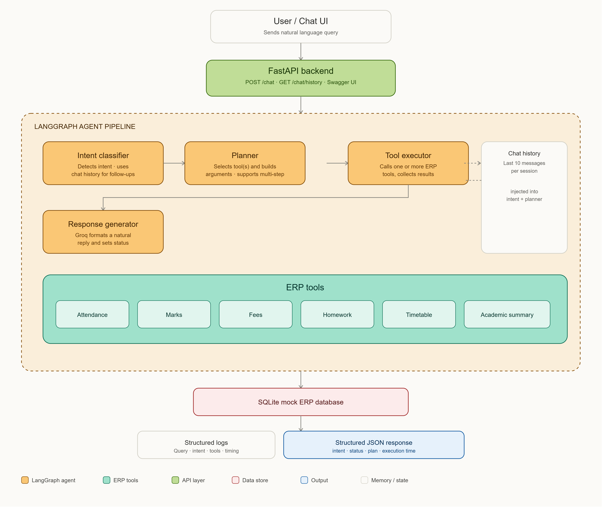

# AI School ERP Assistant

## Architecture



## Setup Instructions

### 1. Clone and create virtual environment

```bash
git clone <your-repo-url>
cd school-ai-assistant
python -m venv venv

# Windows
venv\Scripts\activate

# macOS/Linux
source venv/bin/activate
```

### 2. Install dependencies

```bash
pip install -r requirements.txt
```

### 3. Configure environment variables

Create a `.env` file in the project root (save as **UTF-8**):

```env
GROQ_API_KEY=your_groq_api_key_here
STUDENT_ID=S001
MODEL_NAME=llama-3.3-70b-versatile
```

Get a free Groq API key at [console.groq.com](https://console.groq.com).

### 4. Run the server

```bash
uvicorn main:app --reload
```

### 5. Access the application

- **Chat UI**: http://127.0.0.1:8000/
- **Swagger API docs**: http://127.0.0.1:8000/docs
- **ReDoc**: http://127.0.0.1:8000/redoc

The SQLite database and mock ERP data are seeded automatically on first run.

---

## API Reference

### `POST /api/v1/chat`

Request:
```json
{
  "message": "Show my attendance for this month.",
  "session_id": "session_001"
}
```

Response:
```json
{
  "intent": "Attendance",
  "response": "Your attendance for June 2026 is 88%. You were absent 4 days.",
  "status": "Average",
  "session_id": "session_001",
  "tools_called": ["get_attendance"],
  "plan": [{"tool": "get_attendance", "args": {"month": "2026-06"}}],
  "reasoning": "User asked about attendance | Plan: Fetch June attendance",
  "execution_time": 1.243,
  "timestamp": "2026-06-29 14:30:00",
  "data": {}
}
```

### `GET /api/v1/chat/history?session_id=session_001&limit=20`

Returns full conversation history for a session.

### `GET /api/v1/chat/sessions`

Lists all active sessions with message counts.

### `DELETE /api/v1/chat/history`

Clears history for a given session.

---

## Example Queries

Show my attendance for this month.
Show my Mathematics marks.
Have I paid this month's fees?
What homework is pending?
Show tomorrow's timetable.
Show my attendance, display my Mathematics marks, and tell me if I have any pending fees.
Summarize my academic performance this semester.
Which subject has the highest score?   (follow-up, uses memory)

---

## Bonus Features Implemented

1. **Multi-step task execution** — the planner can select multiple tools in one pass; the executor runs them all and the response generator combines results into one coherent reply.
2. **Academic Performance Summary** — a dedicated tool aggregating marks, attendance, homework, and fees into an overall performance report with AI-generated suggestions.

---

## Error Handling

| Scenario | Behavior |
|---|---|
| Empty request | `400 Bad Request` |
| Invalid student ID | Tool returns structured error, surfaced in response |
| Missing records | Tool returns "no records found" message |
| Invalid/unintelligent query | Intent = "Unknown", assistant asks for clarification |
| Tool/API failure | Caught per-tool, logged, doesn't crash the request |
| Unexpected exceptions | `500` with safe error message, fully logged |

---

## Logging

Every request logs: timestamp, session ID, user query, detected intent, tools used, execution time, status, and a response preview — written to `logs/app.log`.

---

## Author

Smit Pandit
[Portfolio](https://smitpandit.vercel.app) · [GitLab](https://gitlab.com/smitpandit2004)